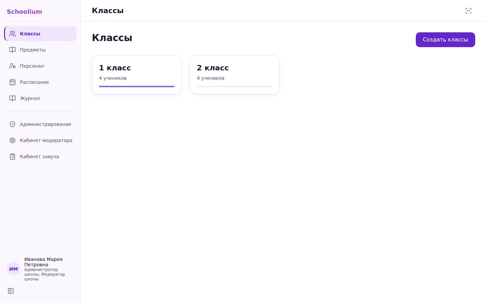
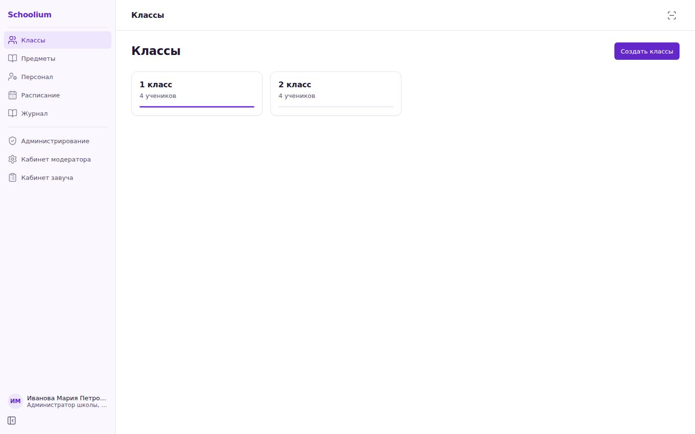
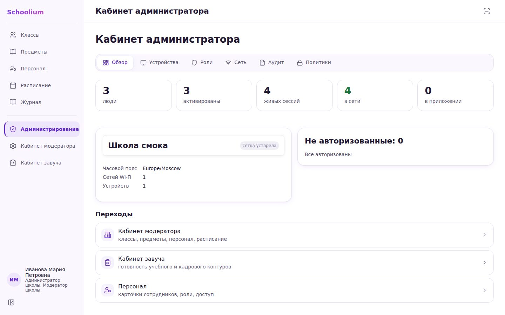
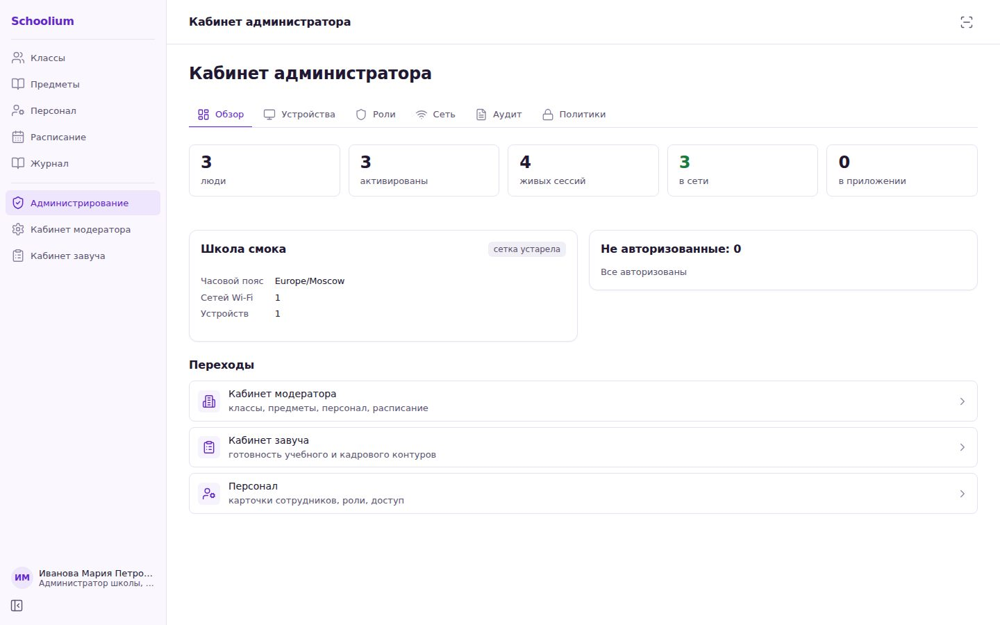
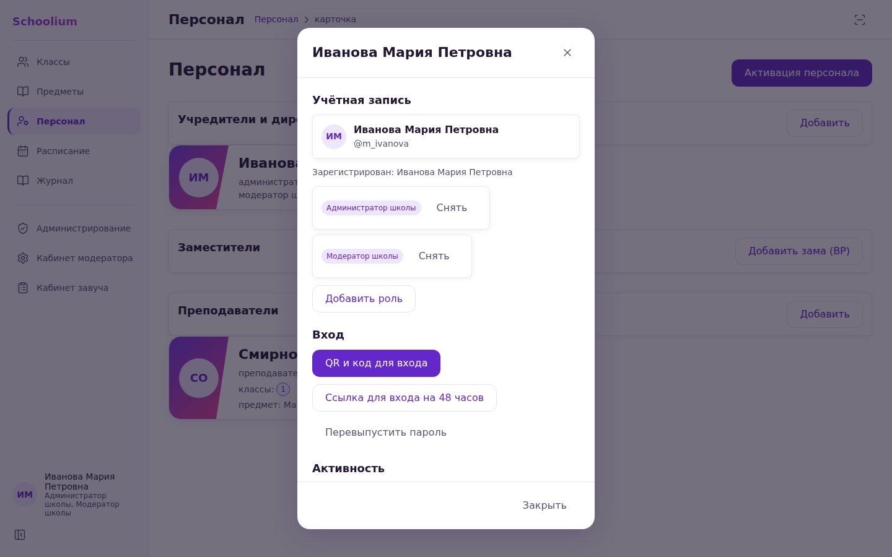
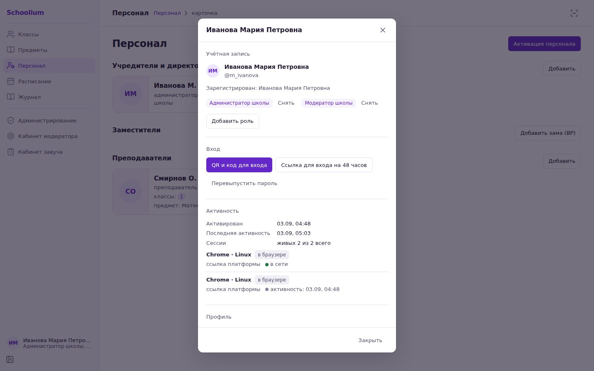
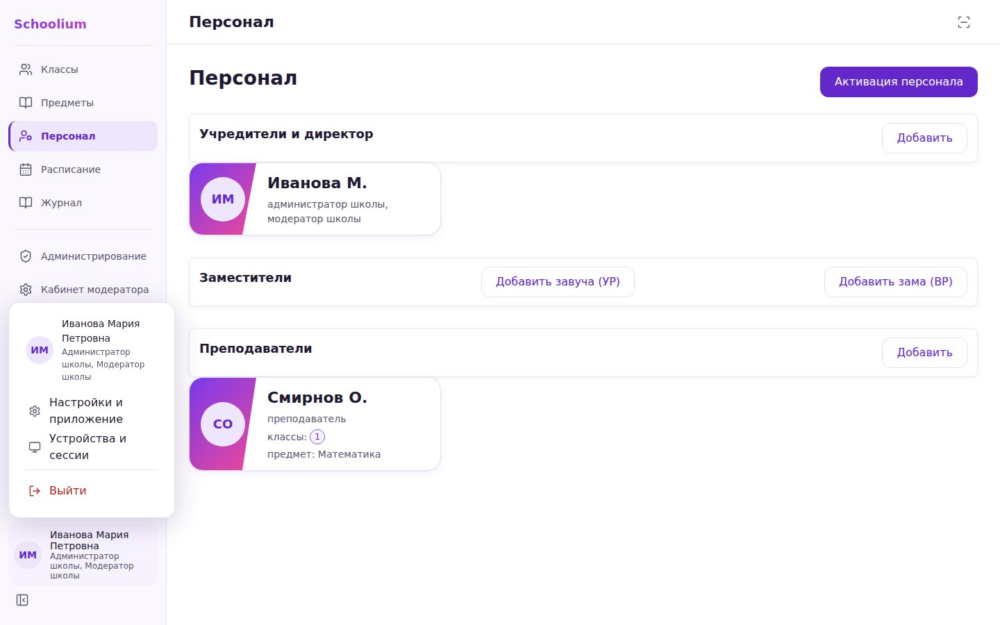
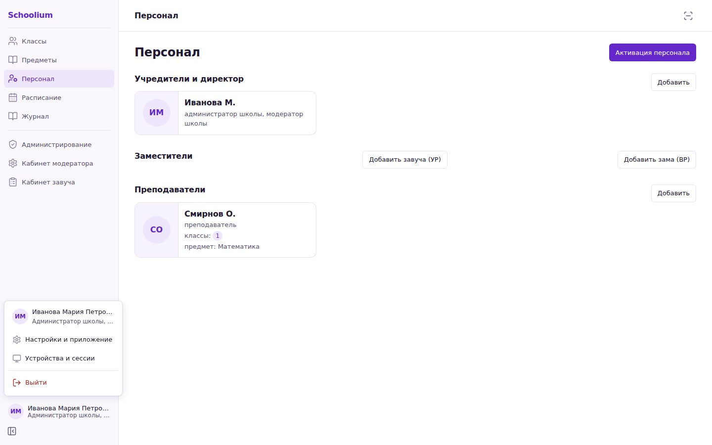

# Пакет «Дизайн 1.4.0»: отчёт

Задание — [DESIGN-SESSION-PROMPT.md](../../DESIGN-SESSION-PROMPT.md). Решения —
**AR-197** (библиотека компонентов) и **AR-198** (дизайн-система) в
[docs/ar/ui.md](../../ar/ui.md); замеры выбора — [library-choice.md](./library-choice.md).
Поведение экранов, маршруты и идентификаторы `data-testid` не менялись: экраны
(`screens/*.tsx`) не тронуты, менялись `ui.tsx`, `shell.tsx`, `app.css`,
`tokens.json` и CSS экранов.

## 1. Что заменено

| Компонент `ui.tsx` | Было (1.3.0) | Стало (1.4.0) |
|---|---|---|
| `Modal` | своя ловушка `Tab`, свой возврат фокуса, эффект «перефокусировать после рендера» | `@radix-ui/react-dialog`: `role`/`aria-modal`/`aria-labelledby`, FocusScope (следит и за удалением сфокусированного узла), `Esc`, клик мимо, блокировка прокрутки. Наши — `data-shape` (desktop / fullscreen / sheet), уровень, шапка, футер, ручка и свайп листа |
| `Popover` / `PopoverOrSheet` | позиционирование руками по `innerWidth`/`innerHeight`, своя ловушка | `@radix-ui/react-popover` (`modal` — реестр §3 требует ловушку; `Anchor virtualRef` принимает прежний `DOMRect`), Popper с уходом от края |
| `Toast` | `div role="status"`, `position: fixed` | `@radix-ui/react-toast`: область `role="region"` с горячей клавишей, `role="status"` + aria-live, свайп вниз |
| `Avatar` | `img` либо `span` с инициалами | `@radix-ui/react-avatar`: инициалы до загрузки фото и при битой ссылке |
| подсказки свёрнутого сайдбара (`shell.tsx`) | атрибут `title` | `@radix-ui/react-tooltip`: по наведению и по фокусу, `Esc`, `aria-describedby` |

Radix входит в контур только через `ui.tsx` и `shell.tsx` — держится воротами **G-84**
(`tools/design/check-layers.mjs`, в `method:lint` и CI).

## 2. Что осталось самописным и почему

- **`Button`, `Field`, `NumberField`, `Badge`, `Stat`/`StatGrid`, `Skeletons`, `EmptyState`, `ErrorState`, `CopyField`, `StatusDot`, `LinkRow`, `MarkChip`** — презентационные элементы без поведения, которому нужна библиотека; кнопка и поле — нативные элементы, их доступность даёт браузер. У Radix примитивов для них нет.
- **`SubNav`** — `nav` с `aria-current`; `Tabs` Radix сменил бы семантику на `tablist`/`aria-selected`, а реестр `70-screens.md` и смок G-53 читают `aria-current`. Поведение не меняется — оставлен, перерисован вкладками с подчёркиванием.
- **`<select>`** — нативный (AR-197 п. 3): `@radix-ui/react-select` стоил бы +29,3 КБ gzip ради выпадашки, которую телефон рисует системной; смок обращается к нему через `selectOption`. Отдельного компонента `Select` намеренно нет.
- **`NumberField`** — поле с шаговыми кнопками §7, поведение специфично для мастера классов.

## 3. Дизайн-система (AR-198)

Все шкалы — в [`docs/design/tokens.json`](../tokens.json) → `tokens.css` (79 переменных,
`tokens-to-css.mjs --check`). Текст 14 / подписи 13 / заголовок экрана 24 / лендинг 32;
контрол 36 на десктопе и 48 на телефоне (`control.height`); радиусы 4/6/8/12; тени
нейтральные одноуровневые; рамка `border.strong` — единственный отклик hover; ни одной
градиентной плашки (единственный градиент — диагональ спаренной ячейки расписания, он
рисует геометрию); движение — только смена цвета в ответ на действие. Контраст — 34 пары
WCAG 2.1 в G-37, литеральных цветов в контуре 0. Спеки `60-design.md` §2–3 и
`75-adaptive.md` §4–5 переписаны на те же величины (контракт раньше кода).

Найденные и снятые дефекты 1.3.0: коллизия классов `.sch-row`/`.sch-chip` с легаси-CSS
расписания учителя (рамки и сдвиг на hover по всему контуру), несуществующая переменная
`--c-danger-600` в мастере классов, QR ссылки входа за краем карточки в `S-62.devices`,
обрезанные вкладки студии `S-42` на телефоне.

## 4. Размер бандла (Vite, `apps/web/dist`)

| | JS приложения | CSS | Отложенный чанк `jsQR` |
|---|---|---|---|
| до (main b90d332, 1.3.0) | 542,3 КБ · **160,8 КБ gzip** | 152,6 КБ · 26,9 КБ gzip | 130,6 КБ · 47,4 КБ gzip |
| после (1.4.0) | 639,5 КБ · **193,5 КБ gzip** | 157,6 КБ · 27,6 КБ gzip | без изменений |
| дельта | +97,2 КБ · **+32,7 КБ gzip** | +5,0 КБ · +0,7 КБ gzip | — |

Зонд AR-197 предсказывал +32,3 КБ gzip за Dialog + Popover + Toast + Tooltip; факт +32,7
(плюс Avatar 2,0). Themes стоила бы +42,4 КБ JS и +81,9 КБ CSS gzip.

## 5. Ворота и прогоны

Каждый шаг — отдельный PR в `main`, перед каждым локально зелёные `npm run method:lint`,
`smoke:onboarding` (G-53), `smoke:onboarding:mobile` (G-55), `schoolium:check`; CI на
коммите шага зелёный.

| Шаг | PR | Коммит | CI |
|---|---|---|---|
| 1 · библиотека (AR-197) | [#3](https://github.com/voldobrovolsky-ux/Schoolium/pull/3) | 89eba11 | [run 80](https://github.com/voldobrovolsky-ux/Schoolium/actions/runs/33705948130), PR-прогон [run 81](https://github.com/voldobrovolsky-ux/Schoolium/actions/runs/33706109686) (флейк легаси-смока учебника, перезапуск зелёный) |
| 2 · дизайн-система (AR-198) | [#4](https://github.com/voldobrovolsky-ux/Schoolium/pull/4) | 9a2680b | [run 84](https://github.com/voldobrovolsky-ux/Schoolium/actions/runs/33709336344), [run 85](https://github.com/voldobrovolsky-ux/Schoolium/actions/runs/33710140257) |
| 3 · `ui.tsx` на Radix, G-84 | [#5](https://github.com/voldobrovolsky-ux/Schoolium/pull/5) | 39e6623 | [run 87](https://github.com/voldobrovolsky-ux/Schoolium/actions/runs/33712264406) |
| 4 · оболочка | [#6](https://github.com/voldobrovolsky-ux/Schoolium/pull/6) | c6d1561 | [run 90](https://github.com/voldobrovolsky-ux/Schoolium/actions/runs/33714090485) |
| 5 · карточка сотрудника | [#7](https://github.com/voldobrovolsky-ux/Schoolium/pull/7) | b0799a0 | [run 93](https://github.com/voldobrovolsky-ux/Schoolium/actions/runs/33715813906) |
| 6 · проход экранов, снимки; версия 1.4.0 | [#8](https://github.com/voldobrovolsky-ux/Schoolium/pull/8) | 169c19f, 9db7820 | [run 96](https://github.com/voldobrovolsky-ux/Schoolium/actions/runs/33717739766), [run 33719274839](https://github.com/voldobrovolsky-ux/Schoolium/actions/runs/33719274839), [run 33719278542](https://github.com/voldobrovolsky-ux/Schoolium/actions/runs/33719278542) |

Деплой с `main` (0549400): прогон deploy-school №31 — [run 33720540447](https://github.com/voldobrovolsky-ux/Schoolium/actions/runs/33720540447), `API /healthz: 200`, бандл `index-Bo8DgBT7`, воркер версионирован, оболочка `no-cache`; теги `deploy/20260903-0554-run31`, `deploy-current → 0549400`, `deploy-previous → b90d332`. Подробности для стенда — `docs/PROD-STATUS.md`, раздел «Релиз 1.4.0».

Все прогоны G-53 и G-55: 65 шагов, 0 нарушений, 20 модалок реестра §3 открыты и закрыты.
Первый мобильный прогон шага 2 поймал регресс мишеней 44px (вкладки `S-42`) — исправлен
до мержа, ворота сделали свою работу.
CI на мерж-коммите 0549400 в `main` ([run 100](https://github.com/voldobrovolsky-ux/Schoolium/actions/runs/33720525270)) один раз упал в легаси-чеке `flow:check` («llm упал → fallback regexp разобрал карты», контур учебника, к диффу 1.4.0 не относится — PR #8 менял снимки, отчёт и версию); повтор того же коммита прошёл этот шаг зелёным — тот же класс флейка, что у смока учебника на шаге 1.

## 6. Снимки до/после

`before/` — `main` b90d332 (1.3.0), `after/` — итог 1.4.0; по 11–12 снимков на раскладку
(1440×900 и 390×844): классы, предметы, персонал, расписание, журнал, три кабинета,
настройки, карточка сотрудника `M-06`, меню `M-15`, свёрнутый сайдбар с подсказкой.
Скрипт — `e2e/design-shots.mjs` (снимает готовый `dist`, школа — из базы смока).

| Экран | До | После |
|---|---|---|
| Классы |  |  |
| Персонал, телефон |  |  |
| Кабинет администратора |  |  |
| Карточка сотрудника |  |  |
| Меню пользователя |  |  |
